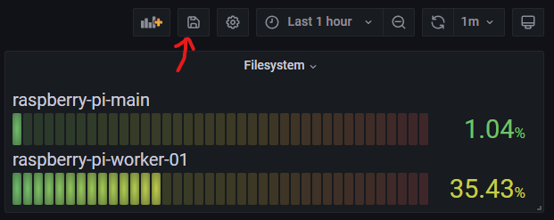
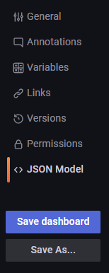

# Custom Dashboards

Grafana offers a variety of dashboards that cover a lot of use cases. \
While the observability stack offers some preconfigured dashboards for common scenarios,
you might have the need for special ones like:

* *Monitoring the traffic going over an Nginx*
* *Track user behavior to gather information about future improvements*
* *Or even visualize certain business metrics*

The options are diverse and unpredictable, therefore it is possible to add custom dashboards to the deployment.

## Add Dashboards using the Grafana UI

Dashboards are created using the Grafana UI. \
Visit the dashboards view and get started by clicking **New Dashboard**.

The [Grafana documentation](https://grafana.com/docs/grafana/latest/getting-started/build-first-dashboard/) covers all
information needed to build a dashboard.

Once you are satisfied you can simply save the dashboard using the save button in the upper right corner:



The dashboard is persisted on the storage that was chosen (host or NFS).

## Add Dashboards to Provisioning

Grafana allows to provision dashboards, a feature that is used for the default dashboards of the observability stack. \
Those dashboards are persisted as JSON files and are created along the deployment.
This also means that they are reset upon restarts and all modifications done are lost.

But it also means that they are safer, cause they can be checked into Git.

You may add your custom dashboards to the provisioning if you wish. \
Click on the dashboard settings right next to the save button. You will see the option **JSON Model** on the left side:



This allows you to copy the dashboard in JSON format.
Let's assume you save it as `my-custom-dashboard.json` next to the `config.jsonnet`.

All that's left to do is to make it known to the deployment. In the `config.jsonnet` add the following:

```js
{
  grafana+: {
    dashboards+:: [
      {
        definition: importstr 'my-custom-dashboard.json',
        file: 'my-custom-dashboard.json',
        folder: 'Kubernetes',
        title: 'Interesting Business Metrics',
      },
    ],
  },
}
```

That's it. After you redeploy the Grafana configmap and pod, the dashboard gets provisioned. :tada:
